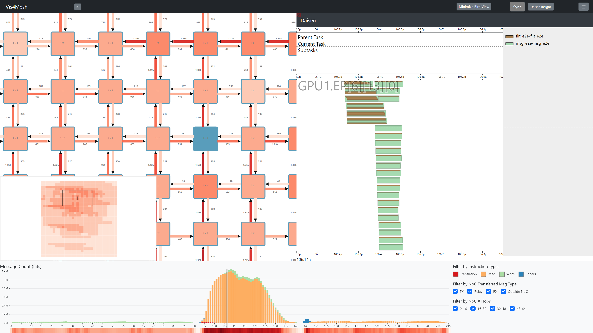

# Vis4Mesh

Vis4Mesh is a visualization tool for designing mesh Network-on-Chips (NoC) and assisting with computer architecture research.
<!-- 
<details open><summary>Snapshot of Vis4Mesh v0.2.3 Release</summary></details>

<details><summary>Snapshot of Vis4Mesh v0.3.0 Preview (in progress)</summary></details> -->

<details><summary>Snapshot of Vis4Mesh with Daisen</summary></details>


## Quickstart

Vis4Mesh is a frontend-only service with the static code repo. A http server is needed to expose the frontend resources to users.

### Online Service

We deployed Vis4Mesh through github pages. Simply open [https://ueqri.github.io/vis4mesh-release/](https://ueqri.github.io/vis4mesh-release/) and we can start visualization in Vis4Mesh.

### Local Deployment

Aside from using github pages, users could build their own service with a http server.

With python3 installed, it is easy to deploy vis4mesh as a service.

1. Enter the directory `vis4mesh/dist`
2. Launch a http server with python
```shell
python3 -m http.server
```

Now vis4mesh is being served on default port 8000. It is able to open it in browser. 

### Upload Data

Once opened in browser, Vis4Mesh allow users to upload a data directory for visualization.

We provided 2 demos under `vis4mesh/visdata`. The data is compressed in zip format. **Each should be decompressed to a directory before using.**

After decompressing, the provided data could be used in Vis4Mesh. Just click the button on the left top in Vis4Mesh main page, and choose to **upload the whole data directory**. For our provided datasets, upload either `conv2d-transfer-32x32` or `fir-100000-transfer` **directory**. Now the data is displayed dynamicly in Vis4Mesh.

<!-- 
<details><summary>Previous example on FIR benchmark with Vis4Mesh v0.2.3</summary></details> -->

### Integration with Daisen

[Daisen](https://gitlab.com/akita/vis) is a profile tool designed for computer architecture. We tried to intergrate it into Vis4Mesh. However it is still an individual tool apart from Vis4Mesh and a data server should be prepared for Daisen visualization.

To use Daisen in Vis4Mesh, you should

1. Select a 1x1 node by clicking it in Vis4Mesh.
2. Press Daisen button in the top bar
3. Input the Daisen server url (e.g. localhost:8888)


## Features

1. **Animated playback of Network-on-Chip traffic**

   Vis4Mesh could playback the NoC traffic and statistics of *any time* and *any region* with the metrics traced from simulation; in this way, researchers can analyze the hotspots and their movement with the tool. Also, it supports brushing a *time range* (in the bottom bar chart) to focus on a specific execution stage, or zooming into a certain *region* to study the network partially.

2. **Temporal and spatial overview to summarize execution behavior**

   As a temporal overview, Vis4Mesh provides a *birdview* and a *transaction vs. time graph* for the whole network. As a spatial overview, it displays the *topology* of the network in various colors based on the achieved bandwidth (or congestion level). With two types of overview, researchers can summarize both the network and execution behavior of a GPU program.

3. **Sheer scalability to visualize millions of devices**

   Existing network visualization tools do not consider the scale of millions of nodes and links. While Vis4Mesh supports *large-scale mesh systems* (e.g., [Cerebras Wafer Scale Engine](https://cerebras.net/blog/cerebras-wafer-scale-engine-why-we-need-big-chips-for-deep-learning/) w/ 400,000 cores connected to NoC) based on a hierarchical packing/unpacking approach for intelligible zooming and acceptable rendering performance.

4. **Collaboration with other simulators and visualization tools**

   Currently, Vis4Mesh can map the *NoC traffic* to the *execution behaviors of GPU programs* with [Daisen](https://osf.io/73ry8/) (a tool for visualizing component-level GPU execution) integrated, which makes it helpful for researchers to figure out which *instruction, request, or hardware component* causes the *hotspots* in the network. Moreover, Vis4Mesh supports NoC tracers for the gem5 or GPGPUSim frameworks, which will be public with our next release.
   
5. **Various filters to identify different types of network traffic**
    
    Vis4Mesh provides 3 orthogonal sets of filters. Instruction filters are based on instruction behavior in computer architecture. Message type filters are based on the roles of links. And hop filters are based on the total hops a message transfers. With different combinations, users could utilize these filters for closer investigations of the dominant traffic type and figure out the network bottleneck. 

## Motivation

Network-on-Chip (NoC) is a popular and widely used communication technology in computer architecture design (especially Systems-on-Chip). But there are some drawbacks associated with it such as long communication latencies and message blocking between two remotely located nodes.

To prototype an efficient NoC, a designer must have insights into network behaviors during execution. Instead of simply looking at the metric numbers such as achieved bandwidth on each link, we believe that a visualization tool would be more intuitive and helpful for designers to analyze the performance issues of NoC systems.

After reviewing the literature and existing tools, we found no systematic solution that is directly applicable to visualizing the NoC (especially the mesh NoC) and provides rich insights and high scalability. Thus we propose Vis4Mesh with four key features as mentioned above.

## Design

Briefly, the tool consists of two parts: **Web frontend** and **Server backend**. Frontend only do rendering work, backend feeds the frontend with preprocessed metrics via our generalized data protocol.

For details, please refer to [doc/design.md](doc/design.md).

## Follow-up

As for follow-up work, we'd implemented these features:

- [x] Fine-tune the zoom interaction for large-scale visualization
- [x] Add minimap for mesh as another type of spatial overview
- [x] Add configuration in front to change the metric data source
- [x] Trace more status data of switch and channels in [Akkalat (Wafer-Scale GPU Simulator)](https://github.com/ueqri/akkalat) and show in side canvas
- [ ] Add plugin store to better organize gem5 tracer, GPGPUSim tracer, and Daisen co-visualization
- [ ] Migrate to [Electron](https://www.electronjs.org/) platform for one-key installation in desktop
- [ ] Build the detailed documents about the design and protocols

## Reference

[MGPUSim: Enabling Multi-GPU Performance Modeling and Optimization (ISCA'19)](https://gitlab.com/akita/mgpusim)

[Tutorial on the Akita Simulator Framework and MGPUSim (HPCA'20)](https://syifan.github.io/akita_hpca2020_tutorial.html)

[Akkalat: Wafer-Scale GPU Simulation Infrastructure (GPGPU'22)](https://github.com/ueqri/akkalat)
